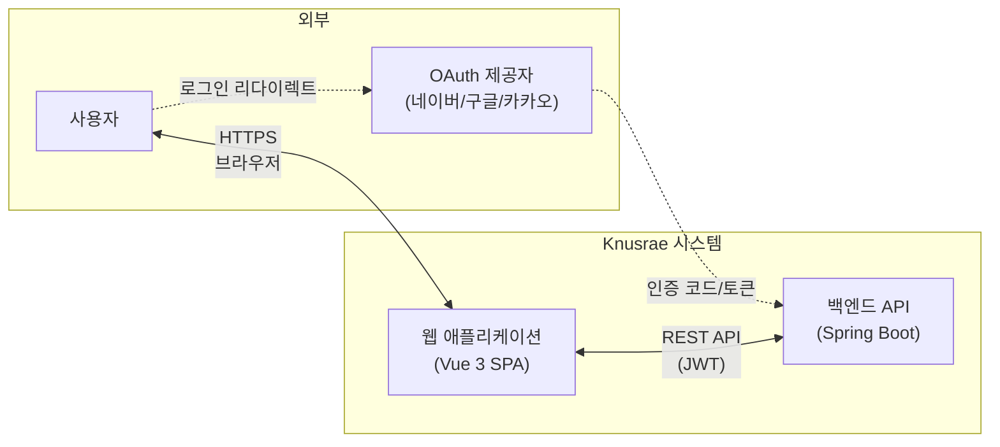
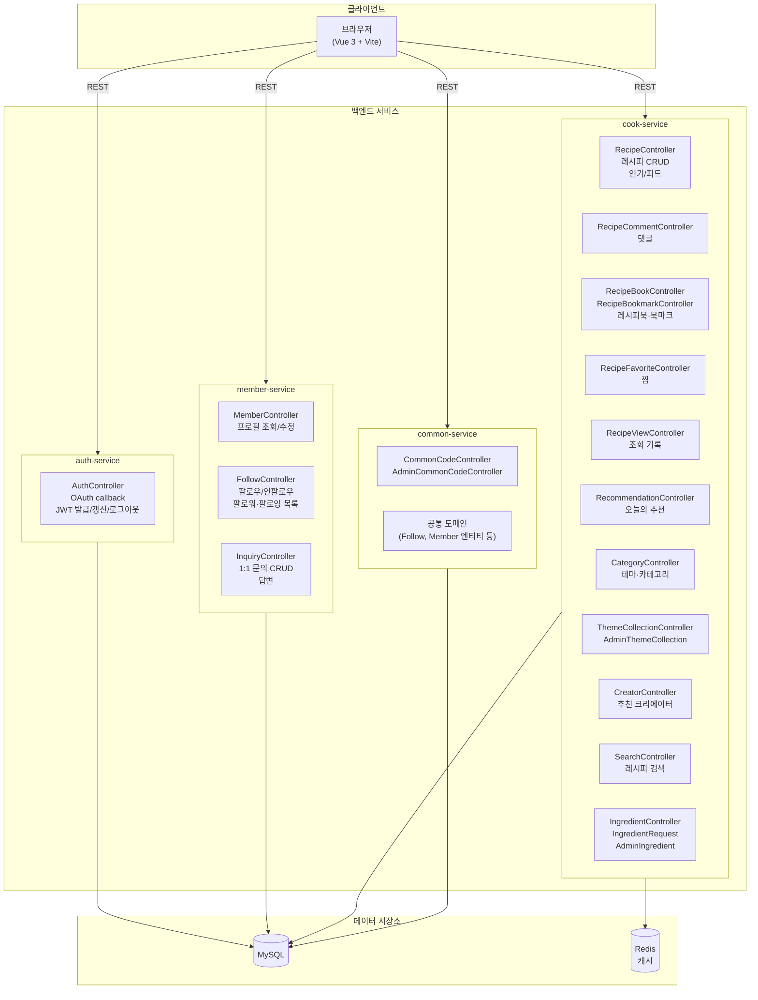
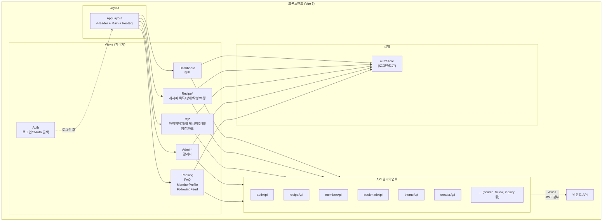
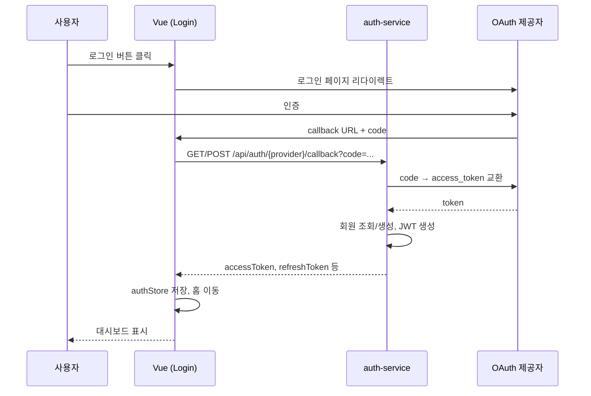
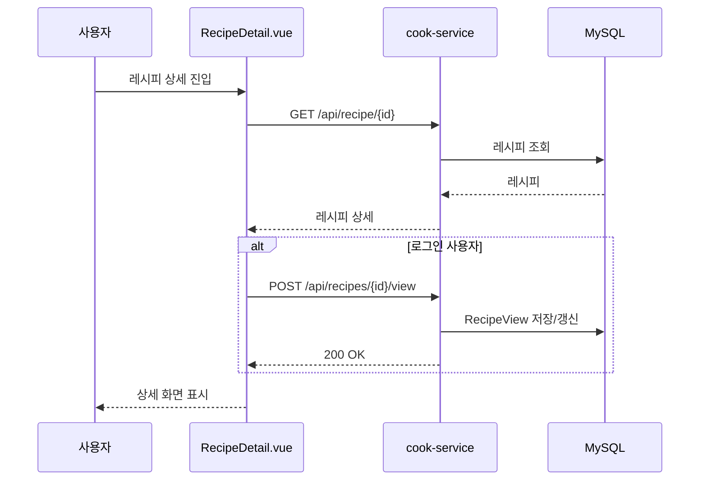
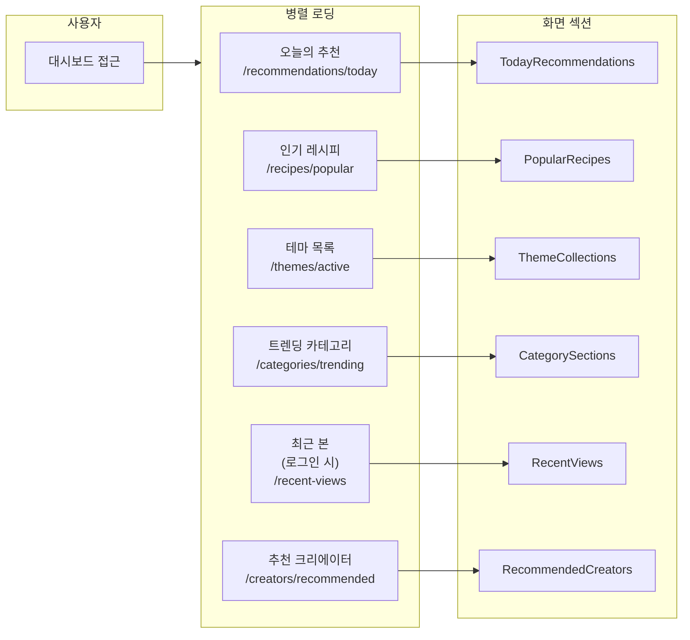
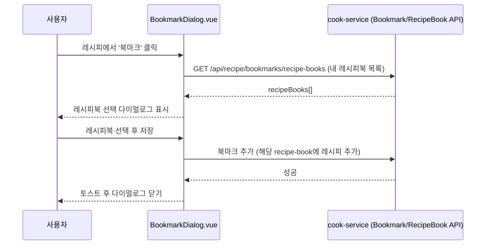

# Knusrae 아키텍처 정의서

## 문서 정보

| 항목 | 내용 |
|------|------|
| 프로젝트명 | Knusrae (크누래) |
| 문서명 | 아키텍처 정의서 |
| 버전 | 1.0 |
| 작성일 | 2026-02-20 |

---

## 1. 개요

본 문서는 Knusrae 애플리케이션의 **시스템 구성**, **서비스 아키텍처**, **주요 데이터·처리 흐름**을 도식으로 정리한다.  
Flow 차트 및 다이어그램은 Mermaid를 사용하며, 뷰어에서 렌더링하면 한 눈에 구조를 파악할 수 있다.

---

## 2. 시스템 컨텍스트

시스템 외부 액터와 Knusrae와의 관계를 나타낸다.



---

## 3. 백엔드 서비스 구성

백엔드는 **마이크로서비스** 형태로 4개 서비스로 구성된다.



---

## 4. 서비스별 역할 요약

| 서비스 | 역할 | 주요 API Prefix |
|--------|------|-----------------|
| **auth-service** | OAuth 로그인, JWT 발급/갱신/로그아웃 | /api/auth |
| **member-service** | 회원 프로필, 팔로우, 1:1 문의 | /api/member, /api/follows, /api/inquiries |
| **cook-service** | 레시피·댓글·북마크·찜·조회·추천·테마·카테고리·크리에이터·검색·재료·관리자 재료 | /api/recipe, /api/recipes, /api/themes, /api/creators, /api/categories, /api/search, /api/ingredients, /api/admin |
| **common-service** | 공통코드 조회/관리, 공통 엔티티(Follow 등) | /api/common-codes, /api/admin/common-codes |

---

## 5. 프론트엔드 구조

프론트엔드는 **단일 SPA**이며, 레이아웃·라우터·상태·API 계층으로 구분된다.



---

## 6. 주요 처리 흐름

### 6.1 로그인 흐름 (OAuth + JWT)



### 6.2 레시피 상세 조회 및 조회 기록



### 6.3 대시보드 데이터 로딩 (병렬)



### 6.4 레시피 북마크 저장 흐름



---

## 7. 기술 스택 요약

| 구분 | 기술 |
|------|------|
| **프론트엔드** | Vue 3, TypeScript, Pinia, Vue Router, PrimeVue, Axios, Vite |
| **백엔드** | Java 17, Spring Boot 3.x, Spring Security, JPA, QueryDSL |
| **DB** | MySQL 8.0 |
| **캐시** | Redis (선택·일부 API 캐싱) |
| **인증** | JWT, OAuth2 (네이버/구글/카카오) |
| **기타** | Spring Scheduler (인기 점수 등 배치성 작업) |

---

## 8. 디렉토리 구조 (참고)

```
Knusrae/
├── frontend/                 # Vue 3 SPA
│   ├── src/
│   │   ├── api/              # API 클라이언트
│   │   ├── components/       # 공통·도메인별 컴포넌트
│   │   ├── layout/
│   │   ├── router/
│   │   ├── stores/
│   │   ├── types/
│   │   ├── views/            # 페이지 단위 View
│   │   └── main.ts
│   └── ...
├── backend/
│   ├── auth-service/
│   ├── member-service/
│   ├── cook-service/
│   └── common-service/
└── docs/
    └── design/
        ├── 01-requirements/  # 본 요구사항·아키텍처
        ├── 02-interface/
        ├── 03-table-definition/
        └── 05-program-list/
```

---

## 9. 변경 이력

| 버전 | 일자 | 변경 내용 |
|------|------|-----------|
| 1.0 | 2026-02-20 | 최초 작성(시스템·서비스·프론트 구조 및 주요 플로우) |
